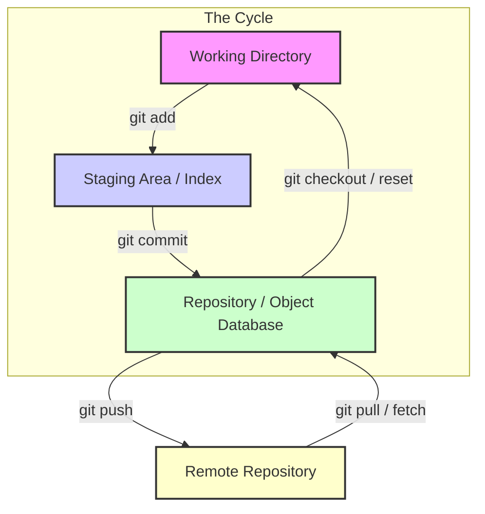

```mermaid
graph TD
    A[Working Directory] -->|git add| B[Staging Area / Index]
    B -->|git commit| C[Repository / Object Database]
    C -->|git push| D[Remote Repository]
    
    subgraph "The Cycle"
    A
    B
    C
    end
    
    D -->|git pull / fetch| C
    C -->|git checkout / reset| A
    
    style A fill:#f9f,stroke:#333,stroke-width:2px
    style B fill:#ccf,stroke:#333,stroke-width:2px
    style C fill:#cfc,stroke:#333,stroke-width:2px
    style D fill:#ffc,stroke:#333,stroke-width:2px
```
